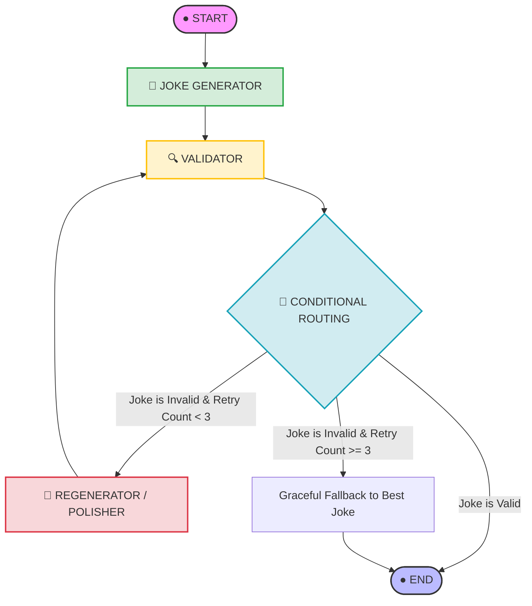

# Bollywood Comedy AI

An AI joke generator with a LangGraph validation loop, Groq LLM backend, FastAPI API, and React/Vite frontend.

## Requirements

---

## 🌀 Core Agent Workflow

The backend is built around a cyclic `StateGraph` in **LangGraph**. The workflow starts by generating a joke, passes it to a validation layer, and dynamically routes it based on quality checks. If validation fails, it enters a self-correction loop where a polisher node rewrites the joke using the validator's specific feedback.



---

## ✨ Features & Architecture

### 1. LangGraph Orchestration & Shared State
The system maintains a central, shared memory called `AgentState`. Every node reads from and writes to this State.
* **`topic`**: The topic of the joke input by the user.
* **`joke`**: The text of the currently generated joke.
* **`hidden_meaning`**: An explanation of the joke and slang for boomers or outsiders.
* **`is_valid`**: Tracks whether the joke passed the strict quality checks.
* **`retry_count`**: Number of times the joke has been regenerated (capped at 3).
* **`validation_errors`**: Detailed reports generated by the validator.
* **`joke_history`**: History log of all attempts, jokes, and errors.
* **`best_joke` / `best_hidden_meaning`**: Graceful fallback values in case the retry limit is hit.

### 2. Multi-Level Validator Node
The validator uses Python logic, regex, and keyword checks to enforce high humor standards:
* **Empty Check**: Ensures a joke was actually generated.
* **Length Guard**: Constrains jokes to be between 15 and 180 characters to keep them punchy.
* **Punctuation & Emoji Check**: Ensures jokes end with proper punctuation or iconic Gen Z expressive emojis (e.g., `💀`, `😭`, `🔥`, `💅`).
* **Conversational Flow**: Validates the presence of conversational pronouns or standard slang connectives.
* **Punchline Structure**: Looks for relatable setups like `POV:`, `when...`, `me trying to...`, or expressive endings.

### 3. Iterative Self-Correction & Polishing
When the validator rejects a joke, it doesn't just ask the LLM for "another joke". The **Regenerator Node** receives:
1. The **original topic**.
2. The **previous failed joke**.
3. The **exact validation failures** (e.g. *"Joke lacks ending punctuation or emojis"*, *"Joke does not sound conversational"*).

The polisher node utilizes this precise feedback to restructure and improve the joke, showcasing **true agentic self-correction**.

### 4. Triple Streaming Capabilities
* **Real-Time Token Output**: The system utilizes LangChain's `chain.stream()` on a `JsonOutputParser` to extract and print only the generated joke token-by-token *while* it is being cooked by Groq, without leaking the hidden explanation early.
* **Streaming Callbacks**: Implements a modular `BaseCallbackHandler` showing how LLM events are intercepted.
* **Streamed Node Responses**: The CLI monitors graph execution by using LangGraph's `.stream()` to notify you in real-time when nodes begin, transition, and complete.

### 5. Hidden Meaning Click-to-Expand Simulator
The backend separates the joke and the explanation into a structured JSON payload:
```json
{
    "joke": "My sleep schedule is sponsored by anxiety fr fr 💀",
    "hidden_meaning": "The joke means anxiety keeps the person awake and ruins their sleep schedule.",
    "is_valid": true,
    "retry_count": 0
}
```
In the terminal, the hidden meaning is concealed at first, and a prompt simulates clicking a dropdown/expandable box to reveal the slang translation.

---

## 🛠️ Setup & Local Installation

### Prerequisites
* **Python 3.11** (Highly recommended, as requested)
* A Groq API Key (Get a free one [here](https://console.groq.com/))

### 1. Installation
Clone or navigate to your workspace directory and verify Python version:
```bash
python --version  # Should return 3.11.x
```

Instantiate your Python 3.11 virtual environment and install requirements:
```powershell
# Create virtual environment
py -3.11 -m venv venv

# Activate virtual environment
.\venv\Scripts\activate

# Install dependencies
pip install -r requirements.txt
```

### 2. API Key Configuration
Create a `.env` file in the project root directory (a template is provided) and enter your Groq API key:
```env
- Python 3.11
- Node.js and pnpm
- A [Groq API key](https://console.groq.com/)

## Setup

```powershell
py -3.11 -m venv venv
.\venv\Scripts\activate
pip install -r requirements.txt
Copy-Item .env.example .env
```

Open `.env` and replace the placeholder with your Groq API key. Never commit `.env`.

Install the frontend dependencies:

```powershell
cd Frontend
pnpm install
```

## Run Locally

In one terminal, start the API:

```powershell
uvicorn app:app --reload --port 8000
```

In another terminal, start the frontend:

```powershell
cd Frontend
pnpm dev
```

Open the URL printed by Vite. The CLI version is also available with `python main.py`.

## Publish to GitHub

From the project root:

```powershell
git init
git add .
git commit -m "Initial commit"
git branch -M main
git remote add origin https://github.com/YOUR-USERNAME/YOUR-REPOSITORY.git
git push -u origin main
```

Create the GitHub repository first, keep it empty, and replace the remote URL with your own. The `.gitignore` excludes API keys, virtual environments, caches, frontend dependencies, and build output.

## Project Layout

- `agent.py`: LangGraph generation and validation workflow
- `app.py`: FastAPI backend
- `main.py`: CLI runner
- `Frontend/`: React/Vite user interface
- `requirements.txt`: Python dependencies
